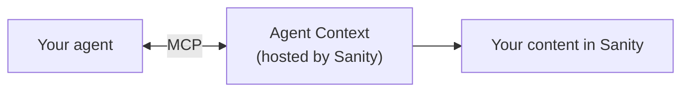

# Sanity Agent Context

> **Alpha**: This project is currently in invite-only alpha. All APIs and interfaces are subject to change.

Give AI agents structured access to your content. Agent Context is a hosted [MCP](https://modelcontextprotocol.io/) endpoint that connects AI agents to your [Sanity Content Lake](https://www.sanity.io/content-lake), where content is stored as structured, queryable data (not pages or blobs of HTML).

Instead of vectorizing your content into embeddings and hoping similarity search returns the right answer, Agent Context lets agents query your actual data model: filter by fields, traverse references between documents, and combine structured queries with semantic search. Embeddings for exploration, structured queries for precision.

## How it works



You create an Agent Context document in [Sanity Studio](https://www.sanity.io/studio) (the editing environment for Sanity). This document controls what content in your Content Lake the agent can access and generates a unique MCP URL. Your agent connects to that URL with an API token.

MCP ([Model Context Protocol](https://modelcontextprotocol.io/)) is a standard for connecting AI agents to external tools. Instead of stuffing text into a prompt, MCP lets your agent call functions on a remote server: query a database, look up a schema, filter by attributes.

Agent Context exposes three tools:

| Tool | What it does |
|------|-------------|
| `initial_context` | Returns a compressed schema overview: your content types, their fields, and document counts |
| `groq_query` | Runs [GROQ](https://www.sanity.io/docs/groq) queries (Sanity's query language) with optional semantic search |
| `schema_explorer` | Returns the full schema for a specific content type |

With these tools, your agent can do things like:

- Look up exact prices, inventory, or metadata (not approximate text matches)
- Filter products by category, size, color, or any field in your schema
- Follow references between documents (a product's brand, a brand's products)
- Combine structured filters with semantic search ("trail running shoes under $150")

Here's what a combined query looks like in [GROQ](https://www.sanity.io/docs/groq), Sanity's query language (see [semantic search in GROQ](https://www.sanity.io/docs/semantic-search-groq)):

```groq
*[_type == "product" && category == "shoes"]
  | score(text::embedding("lightweight trail runner for rocky terrain"))
  | order(_score desc)
  { _id, title, price, category }[0...5]
```

Structural filter (`category == "shoes"`) for precision. Semantic ranking (`text::embedding()`) for discovery. The agent uses whichever fits the question.

## Get started

### Prerequisites

- A [Sanity](https://www.sanity.io/) project with content and a [**deployed Studio**](https://www.sanity.io/docs/deployment) (v5.1.0+)
- A **Sanity API read token**. Create one at [sanity.io/manage](https://sanity.io/manage) (Project → API → Tokens) or via the CLI:
  ```bash
  npx sanity tokens add "Agent Context" --role=viewer
  ```
- An **LLM API key** (Anthropic, OpenAI, or another provider)

New to Sanity? [Start here](https://www.sanity.io/docs/getting-started).

### Using the skill (recommended)

If you're using an MCP-compatible coding tool (Claude Code, Cursor, v0, or similar):

```bash
npx skills add sanity-io/agent-context --all
```

Then prompt your AI assistant:

```
Use the create-agent-with-sanity-context skill to help me build an agent.
```

The skill walks you through Studio setup, MCP connection, and configuration for your stack (Next.js, SvelteKit, Express, Python, etc).

### Manual setup

1. Install the Studio plugin:

   ```bash
   npm install @sanity/agent-context
   ```

   ```ts
   // sanity.config.ts
   import {defineConfig} from 'sanity'
   import {agentContextPlugin} from '@sanity/agent-context/studio'

   export default defineConfig({
     // ...existing config
     plugins: [agentContextPlugin()],
   })
   ```

2. Create an Agent Context document in Studio and copy the MCP URL.

3. Connect your agent. Here's an example using the [Vercel AI SDK](https://sdk.vercel.ai/):

   ```ts
   import {createMCPClient} from '@ai-sdk/mcp'

   const mcpClient = await createMCPClient({
     transport: {
       type: 'http',
       url: 'YOUR_CONTEXT_MCP_URL',
       headers: {
         Authorization: `Bearer ${process.env.SANITY_API_READ_TOKEN}`,
       },
     },
   })
   ```

   Any MCP-compatible framework works. See the [skill reference](./skills/create-agent-with-sanity-context/SKILL.md) for framework-specific guides and advanced patterns.

### Validate the connection

```bash
# Replace vX with the current API version (e.g., v2024-01-01)
curl -X POST "https://api.sanity.io/vX/agent-context/YOUR_PROJECT_ID/YOUR_DATASET" \
  -H "Authorization: Bearer $SANITY_API_READ_TOKEN" \
  -H "Content-Type: application/json" \
  -d '{"jsonrpc": "2.0", "method": "tools/list", "id": 1}'
```

If this returns a list of tools, you're connected. The MCP URL (including API version) is shown in your Agent Context document in Studio.

## Improve quality with Agent Context Explorer

Agent Context Explorer crawls your dataset and generates a knowledge document: a description of your content types, their relationships, and what data lives in each field. Feed this into your agent's system prompt.

```bash
npx @sanity/agent-context-explorer
```

In testing, adding a knowledge document improved agent response quality scores by 30-40 percentage points. The gap between "agent guessing at your data model" and "agent knowing your data model" is that large.

## Examples

| Example | Description |
|---------|-------------|
| [Ecommerce demo](./examples/ecommerce) | Next.js e-commerce app with AI chat ([live demo](https://context-mcp-ecommerce-example.sanity.dev/)) |

## Repository structure

### Packages

| Package | Description |
|---------|-------------|
| [`@sanity/agent-context`](./packages/agent-context) | Studio plugin for managing agent context documents |

### Skills

| Skill | Description |
|-------|-------------|
| [`create-agent-with-sanity-context`](./skills/create-agent-with-sanity-context) | Build an agent with structured Sanity content access |
| [`optimize-agent-prompt`](./skills/optimize-agent-prompt) | Optimize system prompts using dataset knowledge |

### Sandboxes

| Sandbox | Description |
|---------|-------------|
| [`dev-studio`](./sandboxes/dev-studio) | Development sandbox for testing the plugin |

## Troubleshooting

**401 Unauthorized from MCP.** Your `SANITY_API_READ_TOKEN` is missing or invalid. Generate a new token at [sanity.io/manage](https://sanity.io/manage) → Project → API → Tokens (Viewer role is sufficient).

**No schema or empty results.** Agent Context requires a deployed Studio. Run `npx sanity deploy` if you haven't already. Also check that your Agent Context document's content filter matches published documents.

**Tools not appearing.** Verify the MCP URL is correct (project ID, dataset, slug) and that the Agent Context document is published.

## Learn more

- [Agent Context documentation](https://www.sanity.io/docs/agent-context)
- [Getting started guide](https://www.sanity.io/docs/agent-context/getting-started)
- [How to serve content to agents (field guide)](https://www.sanity.io/blog/how-to-serve-content-to-agents-a-field-guide)
- [What is GROQ?](https://www.sanity.io/docs/groq)
- [Content Lake](https://www.sanity.io/content-lake)
- [Sanity Studio](https://www.sanity.io/studio)
- [Model Context Protocol](https://modelcontextprotocol.io/)

## Development

```bash
pnpm install        # Install dependencies
pnpm build          # Build all packages
pnpm dev            # Watch mode
pnpm test:unit      # Run tests
pnpm check:types    # Type check
pnpm check:lint     # Lint
```
