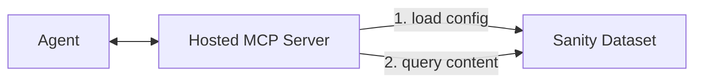

# Sanity Agent Context

> **Alpha**: This project is currently in invite-only alpha. All APIs and interfaces are subject to change.

## What is Agent Context?

Agent Context gives AI agents structured, read-only access to your Sanity content through MCP (Model Context Protocol). Agents can understand your schema, query content with GROQ, follow references, and optionally use semantic search - all while respecting content filters you define.

## How does it work?

Agent Context connects AI agents to your Sanity content through a hosted MCP server:

1. **Agent Context document**: A document in your dataset that configures what content your agent can access (via GROQ filters) and generates a unique MCP URL
2. **Hosted MCP server**: Sanity hosts the MCP server at the generated URL. When your agent connects, it loads the configuration and exposes tools for schema exploration and content querying
3. **Your agent**: Connects to the MCP URL with a Sanity read token and uses the exposed tools to reason over your content



## Get started

### Prerequisites

Before you begin, ensure you have:

- **A Sanity project** with content you want the agent to access
- **Sanity Studio v5.1.0+** (required for server-side schema)
- **A Sanity API read token** from [sanity.io/manage](https://sanity.io/manage)
- **An LLM API key** from Anthropic, OpenAI, or another provider

### Using the skill

1. Install the skill:

   ```bash
   npx skills add sanity-io/agent-context --all
   ```

2. Prompt your AI assistant:

   ```
   Use the create-agent-with-sanity-context skill to help me build an agent.
   ```

### Manual setup

1. Install and configure the Studio plugin:

   ```bash
   npm install @sanity/agent-context
   ```

   ```typescript
   // sanity.config.ts
   import {defineConfig} from 'sanity'
   import {agentContextPlugin} from '@sanity/agent-context/studio'

   export default defineConfig({
     // ...existing config
     plugins: [agentContextPlugin()],
   })
   ```

2. Create an Agent Context document in your Studio and copy the MCP URL

3. Connect your agent to the MCP (example using Vercel AI SDK):

   ```typescript
   import {createMCPClient} from '@ai-sdk/mcp'

   const mcpClient = await createMCPClient({
     transport: {
       type: 'http',
       url: '<CONTEXT_MCP_URL>',
       headers: {
         Authorization: `Bearer <SANITY_API_READ_TOKEN>`,
       },
     },
   })
   ```
