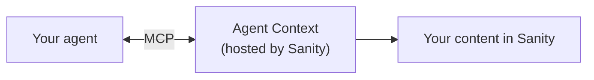

# Sanity Agent Context

Give AI agents structured access to your content. Agent Context is a hosted MCP endpoint that connects AI agents to your Sanity Content Lake, where content is stored as structured, queryable data (not pages or blobs of HTML).

Instead of vectorizing your content into embeddings and hoping similarity search returns the right answer, Agent Context lets agents query your actual data model: filter by fields, traverse references between documents, and combine structured queries with semantic search. Embeddings for exploration, structured queries for precision.

[Read the full documentation →](https://www.sanity.io/docs/ai/agent-context)

## How it works


```mermaid
flowchart LR
  A["Your agent"] <-->|"MCP"| B["Agent Context <br> (hosted by Sanity)"]
  B --> C["Your content in Sanity"]
```

You create an Agent Context document in Sanity Studio. This document controls what content your agent can access and generates a unique MCP URL. Your agent connects to that URL with an API token.

Agent Context exposes three MCP tools:

| Tool              | What it does                                                                       |
| ----------------- | ---------------------------------------------------------------------------------- |
| `initial_context` | Returns a compressed schema overview: content types, fields, and document counts   |
| `groq_query`      | Runs [GROQ](https://www.sanity.io/docs/groq) queries with optional semantic search |
| `schema_explorer` | Returns the full schema for a specific content type                                |

## Get started

### Prerequisites

- A Sanity project with content and a **deployed Studio** (v5.1.0+)
- A **Sanity API read token** — create one at [sanity.io/manage](https://sanity.io/manage) (Project → API → Tokens)
- An **LLM API key** (Anthropic, OpenAI, or another provider)

New to Sanity? [Start here](https://www.sanity.io/docs/getting-started).

### Using skills

If you're using Claude Code, Cursor, or similar, you can install skills that guide your AI assistant through the setup:

```bash
npx skills add sanity-io/agent-context --all
```

Then prompt:

```
Use the create-agent-with-sanity-context skill to help me build an agent.
```

The skill walks you through Studio setup, MCP connection, and configuration for your stack (Next.js, SvelteKit, Express, Python, etc).

Other skills help you refine: `dial-your-context` (tune the Instructions field) and `shape-your-agent` (craft a system prompt).

### Manual setup

1. Install the Studio plugin:

   ```bash
   npm install @sanity/agent-context
   ```

   ```ts
   // sanity.config.ts
   import {defineConfig} from 'sanity'
   import {agentContextPlugin} from '@sanity/agent-context/studio'

   export default defineConfig({
     // ...existing config
     plugins: [agentContextPlugin()],
   })
   ```

2. Create an Agent Context document in Studio and copy the MCP URL.

3. Connect your agent using any MCP-compatible framework. Example with Vercel AI SDK:

   ```ts
   import {createMCPClient} from '@ai-sdk/mcp'

   const mcpClient = await createMCPClient({
     transport: {
       type: 'http',
       url: process.env.SANITY_CONTEXT_MCP_URL,
       headers: {
         Authorization: `Bearer ${process.env.SANITY_API_READ_TOKEN}`,
       },
     },
   })
   ```

## Troubleshooting

**401 Unauthorized** — Your `SANITY_API_READ_TOKEN` is missing or invalid. Generate a new token at [sanity.io/manage](https://sanity.io/manage) → Project → API → Tokens.

**No schema or empty results** — Agent Context requires a deployed Studio. Run `npx sanity deploy`. If you've set a content filter, ensure it matches published documents.

**Tools not appearing** — Verify the MCP URL is correct (project ID, dataset, slug) and that the Agent Context document is published.

## Learn more

- [Agent Context documentation](https://www.sanity.io/docs/ai/agent-context)
- [Getting started guide](https://www.sanity.io/docs/getting-started)
- [How to serve content to agents](https://www.sanity.io/guides/serving-content-to-ai-agents) (field guide)
- [What is GROQ?](https://www.sanity.io/docs/groq)
- [Content Lake](https://www.sanity.io/docs/datastore)
- [Sanity Studio](https://www.sanity.io/docs/sanity-studio)
- [Model Context Protocol](https://modelcontextprotocol.io/)
